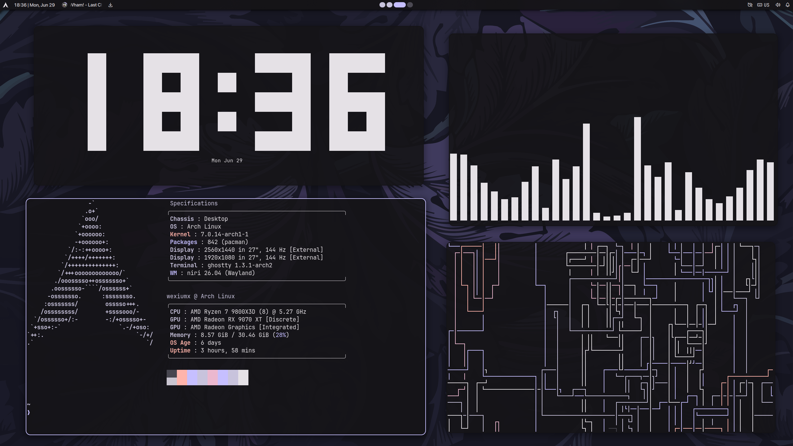
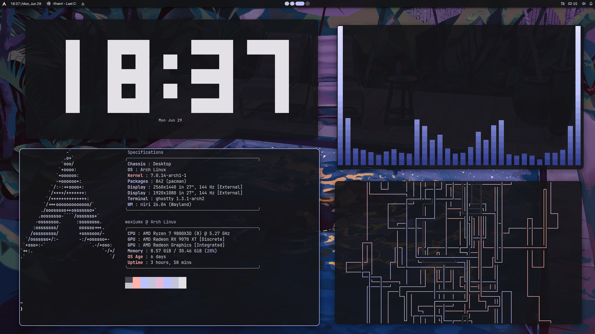
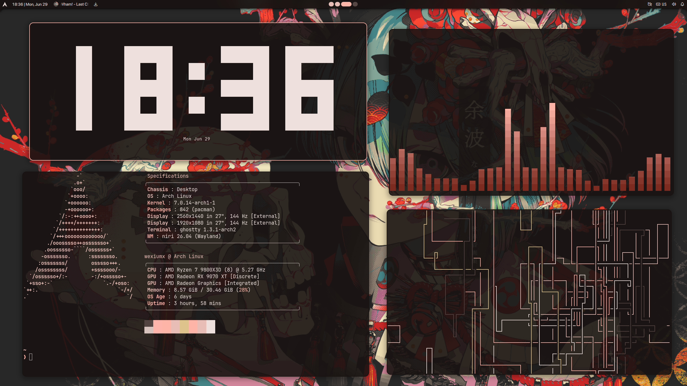

## dotfiles

This is my personal configuration and its only working on **archlinux**






### Installation

> [!IMPORTANT]
> I assume that you already have the 'git' and 'chezmoi' pcakages installed.

```bash
chezmoi init https://codeberg.org/wexiumx/dotfiles
./install-yay-or-paru.sh # optional, you can skip if you have one of them
chezmoi diff
chezmoi apply
```

